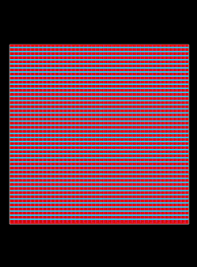
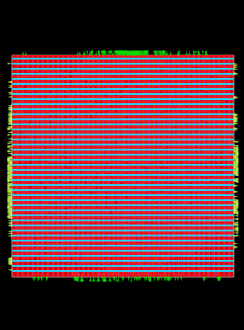
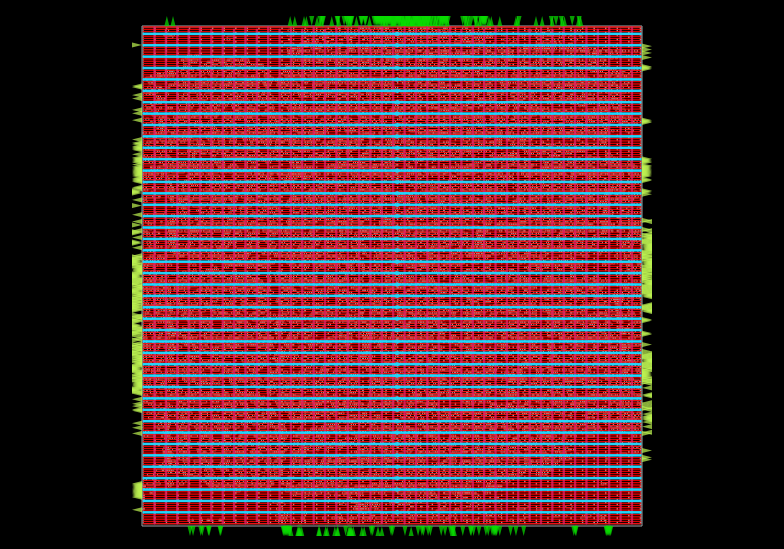
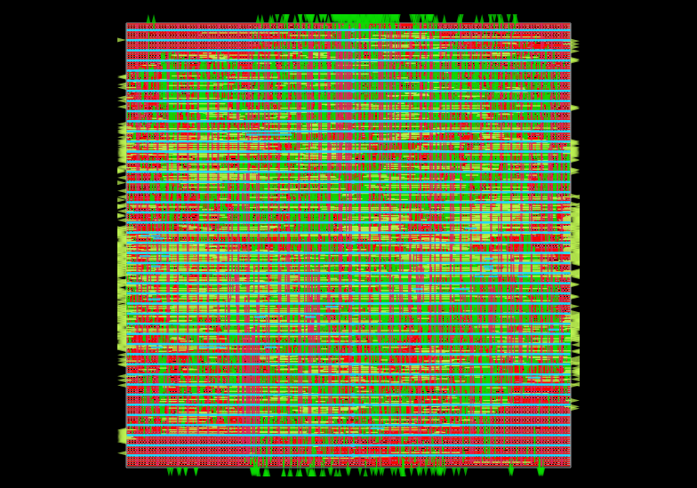
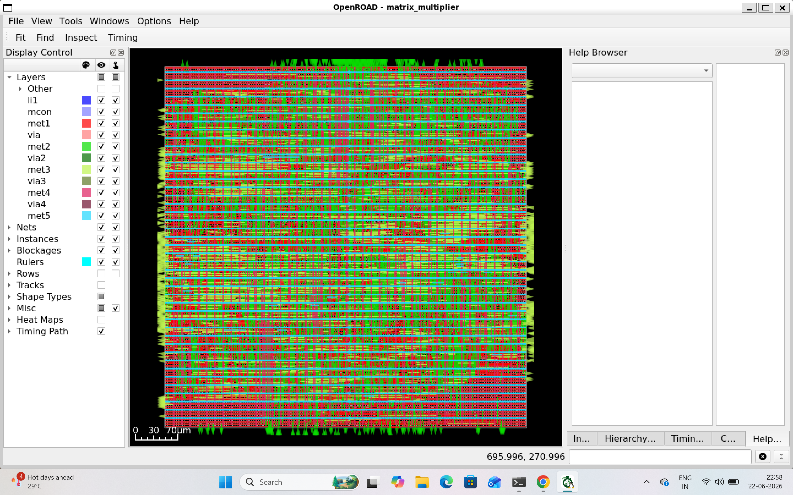

# 4×4 Matrix Multiplier Accelerator using OpenROAD and SKY130HD

## Project Overview

This project implements a synthesizable 4×4 Matrix Multiplier Accelerator in Verilog and performs a complete RTL-to-GDSII ASIC implementation using the OpenROAD flow and SKY130HD standard cell library.

The design flow includes:

* RTL Design
* Logic Synthesis
* Floorplanning
* Placement
* Clock Tree Synthesis (CTS)
* Global Routing
* Detailed Routing
* Timing Analysis
* Power Analysis
* Physical Verification

---

## Design Specifications

| Parameter            | Value                 |
| -------------------- | --------------------- |
| Design               | 4×4 Matrix Multiplier |
| RTL Language         | Verilog HDL           |
| Technology           | SKY130HD              |
| Synthesis Tool       | Yosys                 |
| Physical Design Tool | OpenROAD              |
| Clock Period         | 10 ns                 |
| Target Flow          | RTL-to-GDSII          |

---

## Design Architecture

The accelerator multiplies two 4×4 matrices:

A × B = C

Where:

* A = 4×4 input matrix
* B = 4×4 input matrix
* C = 4×4 output matrix

Each output element is generated using multiply-and-accumulate operations.

---

## RTL to GDSII Flow

### 1. RTL Design

* Verilog implementation of matrix multiplier
* Synchronous design using clock and reset

### 2. Logic Synthesis

Performed using Yosys.

Outputs:

* Gate-level netlist
* Area estimation
* Timing estimation

### 3. Floorplanning

* Core area generation
* Power planning
* Tap cell insertion

### 4. Placement

* Global Placement
* Detailed Placement
* Timing optimization

### 5. Clock Tree Synthesis (CTS)

* Clock buffer insertion
* Clock skew reduction
* Timing closure

### 6. Routing

* Global Routing
* Detailed Routing
* Antenna fixing
* DRC cleanup

---

## Physical Design Results

| Metric             | Value      |
| ------------------ | ---------- |
| Technology         | SKY130HD   |
| Design Area        | 148653 µm² |
| Utilization        | 42%        |
| Clock Period       | 10 ns      |
| Worst Slack        | +1.6056 ns |
| Total Power        | 0.14 W     |
| DRC Violations     | 0          |
| Antenna Violations | 0          |

---

## Floorplan



---

## Placement



---

## Clock Tree Synthesis



---

## Routing



---

## Final Layout



---

## Reports Included

* Floorplan Report
* Placement Report
* CTS Report
* Routing Report
* Timing Report
* Power Report

Located in:

```text
reports/
```

---

## Repository Structure

```text
MatrixMultiplier_OpenROAD_SKY130HD/
├── rtl/
├── constraints/
├── config/
├── reports/
├── screenshots/
└── README.md
```

---

## Tools Used

* Verilog HDL
* Yosys
* OpenROAD
* OpenSTA
* SKY130HD Standard Cell Library
* Git
* GitHub

---

## Key Learning Outcomes

* RTL Design using Verilog
* ASIC Synthesis Flow
* Floorplanning
* Placement Optimization
* Clock Tree Synthesis
* Routing and Timing Closure
* Physical Design Analysis
* Open-Source ASIC Design Flow

---

## Author

**Shaik Nasreen**

GitHub: https://github.com/snasreen2007-glitch

